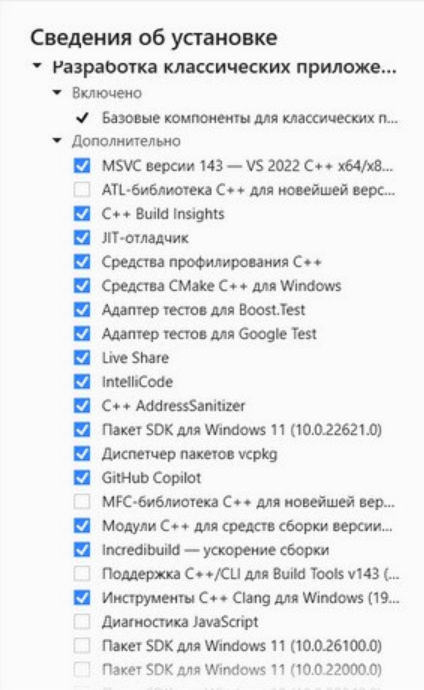
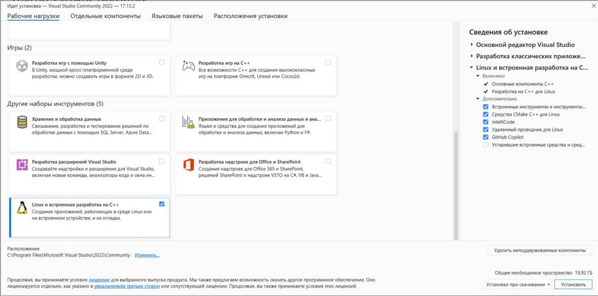
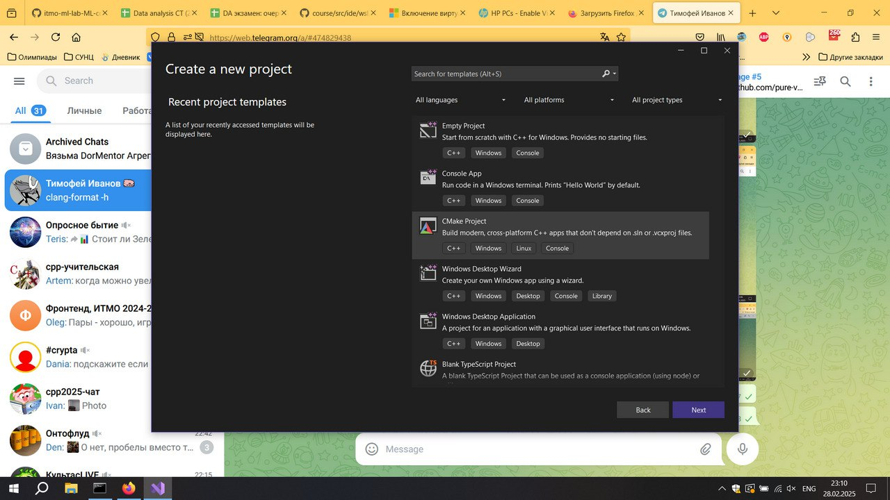
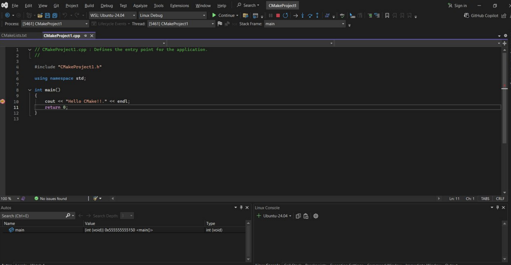

# Гайд для Windows 10 и Windows 11

### WSL
1. Для начала надо обновить Windows до последней сборки (открыть окно "Обновление и безопасность" в параметрах системы (Windows+I) и обновить там всё, что предлагают). Обновлять Windows 10 до Windows 11 не требуется, требуется только скачать последнюю версию Windows 10.
2. Надо поставить себе WSL. Делается это так: открываете консоль, набираете команду `wsl --install -d Ubuntu-24.04`. Если оно завершается успешно, пишете в консоли `wsl`, после чего установка завершается, и вы счастливый человек.
3. Запустить в WSL `sudo apt update && sudo apt upgrade`.
4. Запустить в WSL `sudo apt install cmake ninja-build gdb clang make rsync zip`.

### Visual Studio
1. Дальше надо установить себе IDE. Я рекомендую [Visual Studio 2022 Community](https://visualstudio.microsoft.com/ru/free-developer-offers/).
2. В Visual Studio нужно поставить некоторые компоненты, которые не ставятся из коробки. Сейчас скажу, какие.
3. Нажмите на "разработка классических приложений на C++". Там в окне справа надо выбрать дополнительные компоненты (см. картинку).

    
4. Нажмите на "Linux и встроенная разработка на C++". Выберите там все компоненты, кроме "Устаревшие встроенные средства и средства интернета вещей" (см. картинку)

    
5. Откройте сверху вкладку "Языковые пакеты" и выберите там английский язык. Желательно также удалить русский, потому что он не поможет, а только помешает.
6. Оставьте Visual Studio скачиваться и устанавливаться. В это время можно установить другие необходимые компоненты.
7. После окончания установки перезагрузите компьютер.

### ClangFormat
1. Это тулза для автоматического форматирования ваших документов. К сожалению, установить только её на Windows не позволяют, придётся устанавливать LLVM целиком.
2. Скачать его можно с [этого сайта](https://github.com/llvm/llvm-project/releases/tag/llvmorg-18.1.8), вам нужно выбрать `LLVM-18.1.8-win64.exe`.
3. Запустите установщик, прокликайте "далее". В определённый момент вас спросят, куда вы хотите установить LLVM. Можно оставить вариант по умолчанию, а можно и поменять — главное, запомните, что вы там указали.

    
4. После окончания установки откройте консоль и наберите команду `clang-format -h`. Если вам напечатают что-то в духе "*команда clang-format не найдена*" или "*clang-format не является именем пакета или внешней программой*", надо выполнить следующие пункты. Если печатает длинный список опция с описаниями, дальше ничего выполнять не надо.
5. Набрать в строке поиска "изменение переменных среды". Выберите "изменение системных переменных среды" (если вы хотите clang-format для всех пользователей на компьютере) или "изменение переменных среды текущего пользователя" (если вы хотите clang-format только для себя).

    
6. В открывшемся окошке нажмите кнопку "переменные среды".

    
7. Вам откроется окно, которое вы видите ниже. Там надо найти переменную Path (либо в верхнем списке, если хотите для текущего пользователя, либо в нижнем, если для всех). После этого нажать кнопку "изменить".

    
8. Нажмите кнопку "создать" и напишите путь, в который вы установили LLVM (см. пункт 3) с припиской `\bin`. Например, я установил LLVM в `C:\Program Files\LLVM`, значит мне надо написать `C:\Program Files\LLVM\bin`.

    
9. Нажмите "ОК" во всех окнах.
10. Закройте консоль, откройте заново и снова попробуйте `clang-format -h`. Если не работает, обратитесь ко мне.

### Настройка Visual Studio.
1. Создаём проект на CMake

    
2. Сверху меняем платформу на "WSL: Ubuntu-24.04":

    
3. После этого в нижнем окне покажут процесс обработки CMake-проекта. Если он завершится как-то иначе, кроме CMake generation finished, это ошибка, напишите об этом мне.

    
4. Выбирайте CmakeProject1 в окне сверху. После этого запустите (на треугольник).

    
5. Если оно успешно запустилось, и напечатало "Hello, Cmake.", значит всё хорошо. Иначе обратитесь ко мне.
6. Поставьте на десятую строчку cpp-файла точку останова (тыкнуть на левую часть окна).

    
7. Запустите программу. Если она остановилась на десятой строке (там появится стрелочка), всё хорошо. Иначе обратитесь ко мне.

    
8. Нажмите кнопочку "перейти к следующей строчке". . Должно напечататься "Hello, Cmake".

